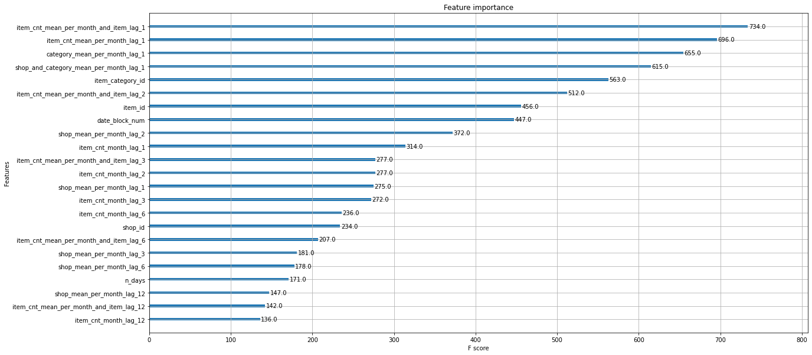

# kaggle_predict_future_sales

Repository for the kaggle challenge [Predict Future Sales](https://www.kaggle.com/competitions/competitive-data-science-predict-future-sales) which serves as the final project for the ["How to win a data science competition"](https://www.coursera.org/learn/competitive-data-science/home/welcome) Coursera course.

Assignments for the course are stored [here](notebooks/coursera).

## Description

This challenge serves as final project for the "How to win a data science competition" Coursera course.
In this competition you will work with a challenging time-series dataset consisting of daily sales data, kindly provided by one of the largest Russian 
software firms - 1C Company. 

### Dataset Description

You are provided with daily historical sales data. The task is to forecast the total amount of products sold in every shop for the test set. Note that the list of shops and products slightly changes every month. Creating a robust model that can handle such situations is part of the challenge.

#### File descriptions

* sales_train.csv - the training set. Daily historical data from January 2013 to October 2015.
* test.csv - the test set. You need to forecast the sales for these shops and products for November 2015.
* sample_submission.csv - a sample submission file in the correct format.
* items.csv - supplemental information about the items/products.
* item_categories.csv - supplemental information about the items categories.
* shops.csv - supplemental information about the shops.

#### Data fields

* ID - an Id that represents a (Shop, Item) tuple within the test set
* shop_id - unique identifier of a shop
* item_id - unique identifier of a product
* item_category_id - unique identifier of item category
* item_cnt_day - number of products sold. You are predicting a monthly amount of this measure
* item_price - current price of an item
* date - date in format dd/mm/yyyy
* date_block_num - a consecutive month number, used for convenience. January 2013 is 0, February 2013 is 1,..., October 2015 is 33
* item_name - name of item
* shop_name - name of shop
* item_category_name - name of item category

This dataset is permitted to be used for any purpose, including commercial use.

## Prediction

### Preprocessing
The following preprocessing steps are performed:

#### data cleaning
* negative prices are replaced with median
* outliers are removed

#### Other
* data is aggregated to monthly level
* supplemental data is added

#### Feature engineering
* target lag features
* mean encoded features

### Models
A simple XGBRegressor with minimal hyperparameter optimization is being used.

### Results
Using the XGBRegressor results in a final score of 1.00617 on the public leaderboard.
The most important features are listed below:

